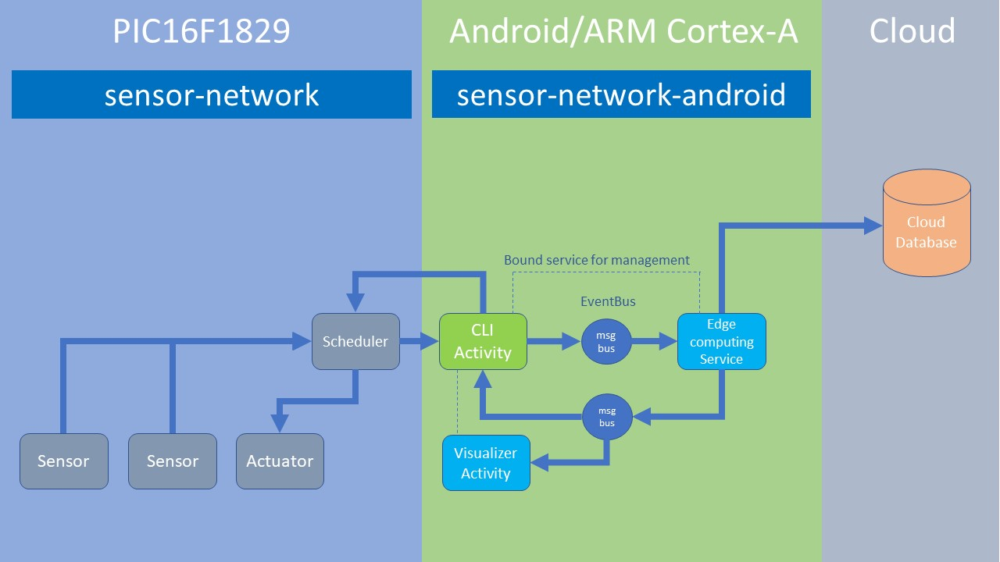

# Sensor network with Android

## Background and motivation

I devise Node-RED-like flow-based programming over very cheap sensor network.

Node-RED is a great tool, and I have been using Node-RED a lot in my IoT prototyping projects. However, Node-RED is heavy and slow on my tiny single board computers such as Raspberry Pi.

So I have developed a flow-based programming framework for PIC16F1-based sensor network. This time, I will develop a framework for Android to add edge computing capabilities to my sensor network.

## Use case: bicycle

I develop in-bicycle network using the output from [sensor-network](https://github.com/araobp/sensor-network).

### Technical requirements

- Very low power consumption
- Cheap
- Show current speed, acceleration, temperature and humidity on a character LCD
- Save time-series data (speed, temperature, humidity, acceleration and location) onto Android smartphone

### Thing: my bicycle

## Development tools

### IDE
- Android: [Android Studio](https://developer.android.com/studio/index.html)

### FTDI driver
- [Android Java D2XX driver](http://www.ftdichip.com/Drivers/D2XX.htm)
- [Android FTDI UART sample](https://github.com/ksksue/Android-FTDI-UART-Sample)
