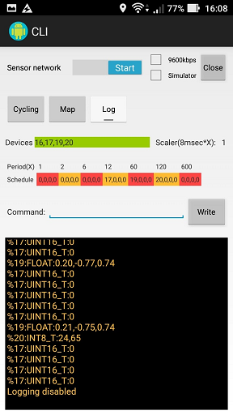

# Sensor network with Android

## Background and motivation

First, I have developed Plug&Play protocol for [PIC16F1-based sensor network](https://github.com/araobp/sensor-network). Next, I will develop a framework for Android to add edge computing capabilities to my sensor network.

## Android apps

### CLI

## Use case: bicycle

I develop in-bicycle network using the output from [sensor-network](https://github.com/araobp/sensor-network). It is like a cheap version of [CANopen](https://www.can-cia.org/canopen/) :-)

### Technical requirements

- Very low power consumption
- Cheap
- Show current speed, acceleration, temperature and humidity on a character LCD
- Save time-series data (speed, temperature, humidity, acceleration and location) onto Android smartphone

### Thing: my bicycle

## Development tools

### IDE
- Android: [Android Studio](https://developer.android.com/studio/index.html)

### FTDI driver
- [Android Java D2XX driver](http://www.ftdichip.com/Drivers/D2XX.htm)
