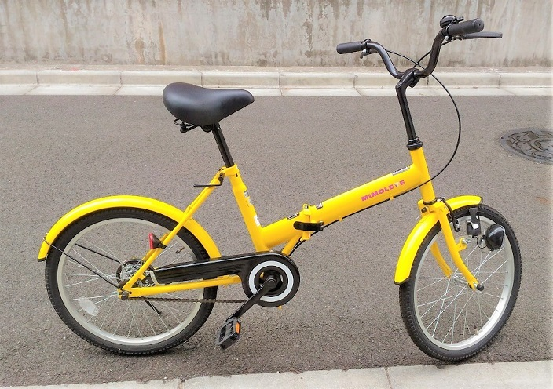

# Bicycle

I develop in-bicycle network using the output from [sensor-network](https://github.com/araobp/sensor-network).

## Requirements

- Very low power consumption
- Cheap
- Show current speed, temperature and humidity on character LCD
- Save time-series data (speed, temperature, humidty, acceleration and location) onto EEPROM (256K bytes)
- Transfer the data on EEPROM to IoT GW

## Thing: my bicycle



## Network

```
   [EEPROM]      
      | I2C                                 (       )
 [Scheduler]--UART/USB--[Android(IoT GW)]--(  Cloud  )
      |                                     (       )
      |                                                                                                
    --+---+-----------------+-----------------+------------+--- I2C bus
          |                 |                 |            |      
   [hall sensor]  [temp/humi sensor]  [accelerometer]   [GPS]
    Front spoke      on handlebar       under saddle   rear fendor
```

## IoT gateway

I use Android smart phone (ASUS ZenFone 2 Lazer) as IoT gateway for the sensor network. Android works as USB host with an USB cable supporting USB OTG.


## Development tools

### CAD
- PCB design: [Eagle](https://www.autodesk.com/products/eagle/overview)
- Encloure design: [FreeCAD](https://www.freecadweb.org/)

### IDE
- 8bit MCU: [MPLAB-X](http://www.microchip.com/mplab/mplab-x-ide)
- Android Studio

### Documentation
- PowerPoint

## References
- [Android USB host mode](http://relativelayout.hatenablog.com/entry/2016/08/12/085051)
