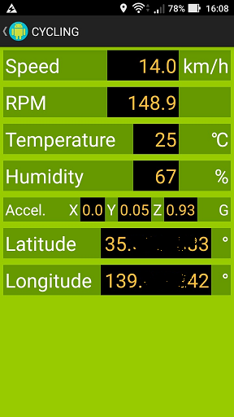

# Sensor network with Android


## Background and motivation

Once I used RasPi/Arduino for IoT prototyping, ending up with unsatisfying results: complicated physical wiring problems.

I stopped using RasPi/Arduino, and I started thinking of a combination of [PIC16F1-based sensor network](https://github.com/araobp/sensor-network) and Android to simplify physical wiring.

## Architecture

This is a framework for developing IoT applications on Android supporting dynamic feature enhancements:

- [(Physical) sensor network and sensor blocks with plug&play protocol](https://github.com/araobp/sensor-network)
- CLI and FTDI device driver (and BLE device driver to be supported in the future)
- [Edge computing components plug-in](https://github.com/araobp/sensor-network-android/tree/master/src/app/src/main/java/jp/araobp/iot/edge_computing/plugin)
- Flow-based programming (to be supported in the future)

CLI is also positioned as a main UI to launch other activities (plug-in etc).

Sensor network simulator is provided for debugging applications on Android w/o a physical sensor network.

I use [EventBus](http://greenrobot.org/eventbus/) to support messaging among components within the application on Android.

### Sensor list

My smartphone is equipped with built-in sensors. I add a sensor network to my smart phone to add other sensors.

|Sensor                   |Built-in|Add-on  |
|-------------------------|--------+--------+
|Three-axis Accelerometer | Y      | Y      |
|Orientation sensor       | Y      | N      |
|Magnetic sensor          | Y      | N      |
|Temperature              | N      | Y      |
|Humidity                 | N      | Y      |
|GPS                      | Y      | N      |

### Swapping Plug-in

At the moment, modify strings.xml manually to replace the current plug-in with another one:
```
<?xml version="1.0" encoding="utf-8"?>
<resources>

    <!-- Edge computing plug-in -->
    <!-- Cycling -->
    <string name="edge_computing_plugin">jp.araobp.iot.edge_computing.plugin.cycling.Cycling</string>
    <string name="edge_computing_plugin_activity">jp.araobp.iot.edge_computing.plugin.cycling.CyclingActivity</string>
    <string name="edge_computing_plugin_button_name">Cycling</string>
    <!-- Template
    <string name="edge_computing_plugin">jp.araobp.iot.edge_computing.plugin.template.Template</string>
    <string name="edge_computing_plugin_activity">jp.araobp.iot.edge_computing.plugin.template.TemplateActivity</string>
    <string name="edge_computing_plugin_button_name">Template</string>
    -->

</resources>
```

In the future, I will add a more dynamic way to swap plug-in.

## Android apps

### Use case: bicycle

I develop in-bicycle network using the output from [sensor-network](https://github.com/araobp/sensor-network). It is like a cheap version of [CANopen](https://www.can-cia.org/canopen/) :-)

### CLI Activity


### Cycling Activity



### Technical requirements

- Very low power consumption
- Cheap
- Show current speed, acceleration, temperature and humidity on a character LCD
- Save time-series data (speed, temperature, humidity, acceleration and location) onto Android smartphone

### Thing: my bicycle


## Development tools

### Programing language
- [Kotlin](https://kotlinlang.org/)

### IDE
- [Android Studio](https://developer.android.com/studio/index.html)

### Libraries
- [Android Java D2XX driver](http://www.ftdichip.com/Drivers/D2XX.htm)
- [EventBus](http://greenrobot.org/eventbus/)

## Links
- [My smart phone: ASUS ZenFone Lazer](https://www.asus.com/Phone/ZenFone-2-Laser-ZE500KL/)
- [Dragon board (Quallcomm)](https://developer.qualcomm.com/hardware/dragonboard-410c)
- [CANopen](https://www.can-cia.org/canopen/)
