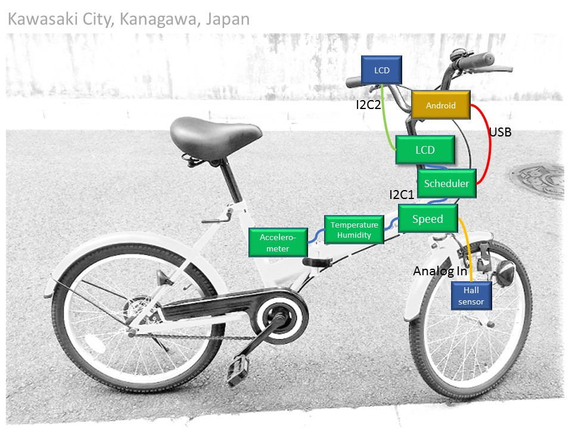

# Sensor network with Android

## Background and motivation

### Edge computing

I have developed Plug&Play protocol for [PIC16F1-based sensor network](https://github.com/araobp/sensor-network). Next, I will develop a framework for Android to add edge computing capabilities to my sensor network.

### Android as IoT gateway

Android provides a lot of tools and facilities to Sunday programmers like me: Android Studio, Google Play... Android seems to me the best choise for IoT gateway prototyping. Smartphone can supply electric power to my sensor network via USB, which is also great to simplify the system.

Once I used RasPi/Arduino for IoT prototyping, ending up with unsatisfying results: complicated physical wiring problems. I stopped using RasPi/Arduino, and I started thinking of the combination of PIC16F1 and Android to simplify physical wirling.

### New technologies

I want to learn new language "Kotlin" and new programming styles such as "RxJava" by programming Android.

## Android apps

### CLI

### Edge computing

### Visualizer

### DB client

## Use case: bicycle

I develop in-bicycle network using the output from [sensor-network](https://github.com/araobp/sensor-network). It is like a cheap version of [CANopen](https://www.can-cia.org/canopen/) :-)

### Technical requirements

- Very low power consumption
- Cheap
- Show current speed, acceleration, temperature and humidity on a character LCD
- Save time-series data (speed, temperature, humidity, acceleration and location) onto Android smartphone

### Thing: my bicycle

## Development tools

### IDE
- Android: [Android Studio](https://developer.android.com/studio/index.html)

### FTDI driver
- [Android Java D2XX driver](http://www.ftdichip.com/Drivers/D2XX.htm)

## Links
- [My smart phone: ASUS ZenFone Lazer](https://www.asus.com/Phone/ZenFone-2-Laser-ZE500KL/)
- [Dragon board (Quallcomm)](https://developer.qualcomm.com/hardware/dragonboard-410c)
- [CANopen](https://www.can-cia.org/canopen/)
